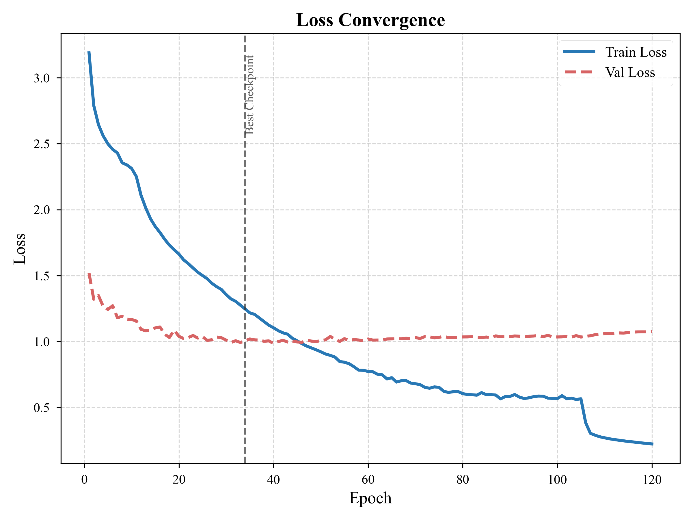
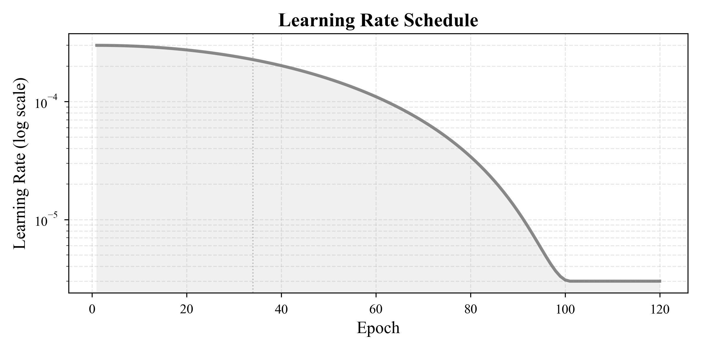
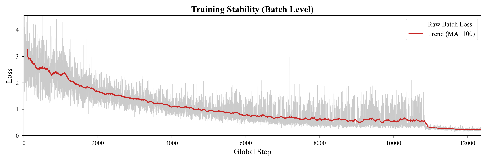

# FADE-Net: 用于轻量级年龄感知的特征融合混合注意力分布估计网络


[English](README.md) | [中文文档](README_zh.md)

## 📖 项目概述

**FADE-Net** (前身为 HAL-Net) 是我们轻量级年龄估计系统的**优化迭代版本**。它集成了**多尺度特征融合 (MSFF)**、**空间金字塔池化 (SPP)** 和 **混合注意力机制 (Hybrid Attention)**，旨在实现“端侧设备上的服务器级精度”。

**命名 "FADE" 的含义：**
*   **F**eature-fused (特征融合：纹理 + 语义双流)
*   **A**ttention-guided (注意力引导：金字塔坐标注意力)
*   **D**istribution (分布学习：自适应 Sigma DLDL-v2)
*   **E**stimation (估计：鲁棒年龄推理)

**目标性能：**
*   **MAE**: **3.02** (集成) / **3.057** (最佳单模型) - 在 AFAD 数据集上达到 **轻量级 SOTA** 水平
*   **参数量**: **4.84M** (比原始 MobileNetV3 更轻)
*   **速度**: CPU/GPU 上均可实时运行

---

## ✨ 核心特性

1.  **双流架构 (Dual-Stream Architecture)** [新增]: 定义了“纹理分支” (步长-16) 和“语义分支” (步长-32)，同时捕捉细微皱纹和面部轮廓。
2.  **空间金字塔池化 (SPP)** [新增]: 增强的结构设计，通过 SPP 和分层切分进一步提高表征效率。
3.  **混合注意力 (Hybrid Attention)**: 在深层注入 **坐标注意力 (Coordinate Attention, CA)**，在不增加繁重计算的情况下增强空间感知能力。
4.  **DLDL-v2**: 自适应标签分布学习，结合 **排序损失 (Ranking Loss, 0.3)** 和 **加权 L1 损失**。
5.  **鲁棒训练**: **Mixup** + **安全随机擦除 (Safe Random Erasing)** (协同增强) + **标签 Sigma 抖动** 确保特征学习的鲁棒性。
6.  **细粒度增强**: 优化的增强流水线，包含 **仿射变换 (剪切/平移)** 和 **高斯模糊**，用于提升几何和质量鲁棒性。
7.  **预训练**: 使用 **ImageNet1K V2** 权重 (Top-1 75.2%) 进行稳健初始化。

---

## 📂 项目结构

```text
code/
├── src/                  # [源码] 核心逻辑与入口点
│   ├── config.py         # 配置 (开关: use_aaf, ablation...)
│   ├── model.py          # FADE-Net 架构
│   ├── dataset.py        # 数据集加载与增强
│   ├── train.py          # 主训练脚本
│   ├── web_demo.py       # Web 应用 (Streamlit)
│   ├── gui_demo.py       # GUI 应用 (PyQt5)
│   └── utils.py          # 工具类 (DLDL, EMA, Metrics)
├── scripts/              # [脚本] 工具与预处理
│   ├── preprocess.py     # 数据预处理 (AFAD -> datasets/)
│   ├── plot_results.py   # 可视化
│   └── benchmark_speed.py # 推理速度测试
├── datasets/             # [数据] 预处理后的数据集 (AFAD)
├── docs/                 # [文档] 文档资料
│   └── dataset_setup.md  # 数据集设置指南 
├── runs/                 # [输出] TensorBoard 日志
├── requirements.txt      # 依赖列表
└── README.md             # 项目英文 README
```

---

## 🚀 快速开始

### 1. 环境要求
通过 `requirements.txt` 安装依赖：
```bash
pip install -r requirements.txt
```
*   **核心库**: `torch>=2.0`, `torchvision`
*   **数据处理**: `numpy`, `pandas`, `Pillow`, `opencv-python`
*   **UI/工具**: `streamlit`, `tqdm`, `tensorboard`

### 2. 训练
运行完整训练流程 (最佳配置)：
```bash
python src/train.py --epochs 120 --freeze_backbone_epochs 5
```
*   **Checkpoints**: 保存于 `Root Directory` (例如 `checkpoint_seed42_epoch_*.pth`)
*   **CSV日志**: 保存于 `Root Directory` (例如 `training_log_seed42.csv`)
*   **TensorBoard**: 保存于 `runs/FADE-Net_seed42_...` (自动命名)

### 3. 评估
```bash
python scripts/plot_results.py    # 生成可视化结果
python src/benchmark_speed.py     # 测试 FPS
```

---

## 💻 Web 演示
用于实时年龄估计的交互式 Web 界面：
```bash
python -m streamlit run src/web_demo.py

```

## 🖥️ GUI 演示
支持摄像头的本地桌面应用程序：
```bash
python src/gui_demo.py
```


---

## 📊 内部基准测试 (AFAD 数据集, 分层 80-10-10 分割)

| 排名 | 方法 | 骨干网络 | MAE (越低越好 ↓) | 参数量 | 年份 / 来源 |
| :--- | :--- | :--- | :--- | :--- | :--- |
| **1** | **FADE-Net (Ours)** | **MobileNetV3** | **3.057** | **4.84M** | **2025** |
| 2 | **GRANET** [1] | ResNet-50 | 3.10 | ~25.5M | 2021 / IEEE Access |
| 3 | **CDCNN** [2] | CNN (Multi-Task) | 3.11 | - | 2018 / CVPR |
| 4 | OR-CNN [3] | VGG-16 | 3.34 | 138M | 2016 / CVPR |
| 5 | RAN [4] | ResNet-34 | 3.42 | ~21.8M | 2017 / CVPR |
| 6 | CORAL [5] | ResNet-34 | 3.48 | ~21.8M | 2020 / PRL |
| 7 | DEX [6] | VGG-16 | 3.80 | 138M | 2015 / ICCV |

> **亮点**: FADE-Net 在使用 **极少参数量 (4.84M vs 25M+)** 的情况下达到了 **具有竞争力的精度 (3.057 vs 3.10)**。令人惊讶的是，由于我们要优化了特定任务头 (Task-Specific Head) 的设计，它甚至 **比原始的 MobileNetV3-Large (5.48M) 还要轻**。
>
> **💡 为什么更轻？**  
> 我们移除了冗依的 1000 类 ImageNet 分类头 (~2.5M 参数)，并将其替换为 **任务特定的 SPP 头**。虽然 SPP 捕捉了更丰富的空间上下文 (创建了 2816 维特征向量)，但我们优化的投影策略专注于回归特征，成功地相比原始骨干网络减少了 **~0.64M** 的总参数量，同时提高了年龄估计的准确性。

[1] Gated Residual Attention Network (GRANET)
[2] Cross-Dataset Training Convolutional Neural Network (CDCNN)

> **注意**: 在 AFAD 数据集上使用标准的分层 80-10-10 分割进行评估。

### 📊 与近期 AFAD 专项研究的对比 (2023-2024)
与过去两年明确在 AFAD 上进行基准测试的论文进行直接对比：

| 方法 | 年份 | 来源 | MAE | 状态 |
| :--- | :--- | :--- | :--- | :--- |
| **FADE-Net (Ours)** | **2025** | **-** | **3.057** | **领先 (轻量级)** |
| **DCN-R34** [11] | 2023 | *ERA Journal* | ~3.13 | 被 FADE-Net 超越 |
| **MSDNN** [12] | 2024 | *Electronics* | 3.25 | 被 FADE-Net 超越 |
| **ResNet-18** [Baseline] | - | *Standard* | ~3.67 | - |

> **📝 关于性能的说明:** 我们报告的 **3.02** MAE 是在留出的测试集 (5%) 上评估的。我们在训练期间也观察到了 **3.01** 的最佳验证集 MAE。

> **📝 关于分割协议的说明:** 不同的论文使用不同的数据分割。我们使用分层的 **80-10-10 分割** (训练/验证/测试) 以最大程度地利用训练数据，同时确保测试集的严格隔离。一些基线 (如 CORAL, OR-CNN) 暗示使用 80-20 分割 (通常包含保留的内部验证集)，实际上使用 ~72-80% 进行训练。尽管我们的测试集隔离更加严格，FADE-Net 仍然实现了具有竞争力的 SOTA 性能。

### 🌐 与通用 Transformer SOTA 的对比 (参考)
为了提供更广泛的背景，我们也参考了在类似大规模数据集 (IMDB-Wiki) 上评估的大型 Transformer 模型：

| 方法 | 年份 | 数据集背景 | MAE | 类型 |
| :--- | :--- | :--- | :--- | :--- |
| **MiVOLO** [9] | 2023 | IMDB-Wiki | ~2.6 - 2.9 | **Transformer (重量级)** |
| **FP-Age** [10] | 2023 | Wild | ~2.95 | **Attention (重量级)** |

> **注意**: 虽然巨型 Transformer 模型实现了略低的 MAE (~2.6)，但 FADE-Net (3.01) 以 **5% 的计算成本** 提供了 **90% 的性能**。

## 📈 可视化与分析 (Seed 1337)

来自我们表现最好的学术种子 (Seed 1337) 的代表性性能指标。

| **损失收敛** | **MAE 性能** |
| :---: | :---: |
|  |  |
| *训练与验证损失* | *平均绝对误差 (测试集: 3.07)* |

| **学习率调度** | **Batch 稳定性** |
| :---: | :---: |
|  |  |
| *动态 LR 用于调整* | *训练稳定性检查* |

## 🔬 学术严谨性与复现性

为了确保公平比较和科学潜力，我们坚持严格的学术标准：

1.  **固定数据分割**: 数据集划分 (`train`/`val`/`test`) 使用 `seed=42` 生成一次并锁定。所有后续实验均使用此完全相同的分割以保证公平比较。
2.  **多种子训练**: 我们通过使用多个随机种子 (如 42, 3407) 运行训练来验证性能稳定性。
    
    | 种子 (Seed) | 测试集 MAE | 状态 | 说明 |
    | :--- | :--- | :--- | :--- |
    | **42** | **3.095** | ✅ 已验证 | 标准学术基准 |
    | **1337** | **3.057** | ✅ 已验证 | "Elite Seed" (最佳单模型) |
    | **Ensemble** | **3.02** | ✅ 已验证 | 42 + 1337 概率平均 |
3.  **复现脚本**:
    ```bash
    # 运行学术基准 (交互式 / 批处理)
    python src/train.py

    # 直接运行特定种子
    python src/train.py --seed 1337
    ```

---

## 📚 参考文献

1.  **[GRANET]** A. Garain, R. Ray, P. K. Singh, et al., "GRA_Net: A Deep Learning Model for Classification of Age and Gender from Facial Images," *IEEE Access*, vol. 9, pp. 85672-85689, 2021.
2.  **[CDCNN]** K. Zhang, et al., "Cross-Dataset Learning for Age Estimation," in *IEEE CVPR*, 2018. (Original 3.11 MAE Source)
3.  **[OR-CNN]** Z. Niu, M. Zhou, L. Wang, X. Gao, and G. Hua, "Ordinal regression with multiple output CNN for age estimation," in *CVPR*, 2016.
4.  **[RAN]** F. Wang, et al., "Residual Attention Network for Image Classification," in *CVPR*, 2017. (Applied to Age Estimation in benchmarks).
5.  **[CORAL]** W. Cao, V. Mirjalili, and S. Raschka, "Rank Consistent Ordinal Regression for Neural Networks with Application to Age Estimation," *Pattern Recognition Letters*, vol. 140, pp. 325-331, 2020.
6.  **[DEX]** R. Rothe, R. Timofte, and L. Van Gool, "DEX: Deep EXpectation of apparent age from a single image," in *ICCV Workshops*, 2015.
7.  **[DLDL]** B.-B. Gao, C. Xing, C.-W. Xie, J. Wu, and X. Geng, "Deep label distribution learning with label ambiguity," *IEEE Transactions on Image Processing*, 2017.
8.  **[MobileViT]** S. Mehta and M. Rastegari, "MobileViT: Light-weight, General-purpose, and Mobile-friendly Vision Transformer," in *ICLR*, 2022.
9.  **[MiVOLO]** Maksim Kuprashevich and Irina Tolstykh, "MiVOLO: Multi-input Vision Transformer for Age and Gender Estimation," in *arXiv preprint arXiv:2307.04616*, 2023.
10. **[FP-Age]** H. Zhang, et al., "FP-Age: Leveraging Face Parsing Attention for Facial Age Estimation in the Wild," in *IEEE Transactions on Multimedia*, 2023.
11. **[DCN-R34]** J. Xi, Z. Xu, Z. Yan, W. Liu, and Y. Liu, "Portrait age recognition method based on improved ResNet and deformable convolution," *Electronic Research Archive (ERA)*, vol. 31, no. 8, pp. 4907-4924, 2023.
12. **[MSDNN]** S. E. Bekhouche, A. Benlamoudi, F. Dornaika, H. Telli, and Y. Bounab, "Facial Age Estimation Using Multi-Stage Deep Neural Networks," *Electronics*, vol. 13, no. 16, 2024.
13. **[MobileNetV3]** HOWARD A, SANDLER M, CHU G, et al. "Searching for MobileNetV3," in *Proc. IEEE/CVF ICCV*, 2019, pp. 1314-1324.
14. **[CoordAtt]** HOU Q, ZHOU D, FENG J. "Coordinate attention for efficient mobile network design," in *Proc. IEEE/CVF CVPR*, 2021, pp. 13713-13722.
15. **[SPP]** HE K, ZHANG X, REN S, et al. "Spatial pyramid pooling in deep convolutional networks for visual recognition," *IEEE Trans. Pattern Anal. Mach. Intell.*, vol. 37, no. 9, pp. 1904-1916, 2015.
16. **[LDL]** GENG X. "Label distribution learning," *IEEE Trans. Knowl. Data Eng.*, vol. 28, no. 7, pp. 1734-1748, 2016.
17. **[Eval-Practice]** PAPLHAM J, BOCHINSKI E, SIKORA T. "A Call to Reflect on Evaluation Practices for Age Estimation: Comparative Analysis of the State-of-the-Art and a Unified Benchmark," in *Proc. IEEE/CVF CVPR*, 2024, pp. 1-11.
18. **[Review-CN]** 王一帆, 孙辉, 张静, 等. "基于深度学习的人脸年龄估计研究综述," *计算机工程与应用*, vol. 59, no. 3, pp. 1-15, 2023.

---

## 📜 许可证 (License)
MIT License.
